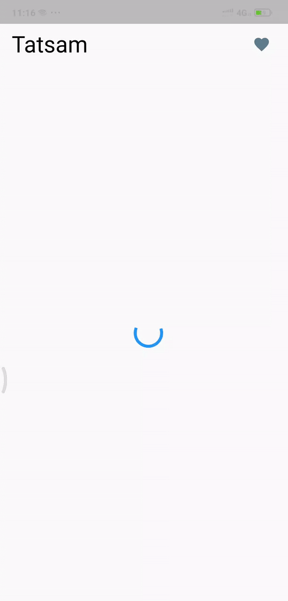

# Tatsam

A Flutter Application to view list of countries and add them to favorites built on BLoC architecture.

.

## Getting Started

You can directly install the apk file from [releases](https://github.com/MrUnfunny/tatsam/releases).

#### Building from source

If you do not have the Flutter SDK installed, follow the instructions from the
Flutter site [here](https://flutter.dev/docs/get-started/install).

To build from source clone the repository:

```
git clone https://github.com/MrUnfunny/tatsam.git
```

Get the dependencies by running this command inside the project directory:

```
flutter packages get
```

Then either run this command to run the app in device:

```
flutter run
```

Or build the apk using this command:

```
flutter build apk
```

#### 🔌 Plugins

| Name                                                      | Usage                            |
| --------------------------------------------------------- | -------------------------------- |
| [**flutter_bloc**](https://pub.dev/packages/flutter_bloc) | State Management                 |
| [**hive**](https://pub.dev/packages/hive)                 | Local Database                   |
| [**http**](https://pub.dev/packages/http)                 | To make api calls                |
| [**equatable**](https://pub.dev/packages/equatable)       | To simplify equality comparisons |

### App Structure

The app is structured as follows:

```
/bloc
/models
/presentation
  /common
  /screens
/repositories
/routing
```

**bloc** contains the state management layer used for communication between UI and repository. `

**presentation** contains all the UI related code. `common` contains common UI widgets used across multiple screens. `screens` contains code for all different screens.

**repository** contains code for interacting with external servers and other tasks. It contains networking, other third party, and database interactions.

**routing** contains code for navigating among different screens in the app.
